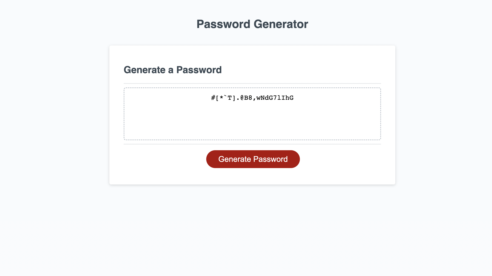

# unique-password-generator

## Description

This webpage is a password generator where a user can answer some prompts and the computer will create a password for the user. Sometimes making a password on your own can be tiring and fitting in all the password requirements can take a while. This password generator will generate a password between 8-128 characters with special characters, numbers, uppercase and lowercase letters. By simply clicking on the "generate password" button, the user can answer a few quick questions to make the password the user wants. With this project, I learned how to use javascript to randomize array elements and concat them.

## Table of Contents

If your README is long, add a table of contents to make it easy for users to find what they need.

- [Installation](#installation)
- [Usage](#usage)
- [Credits](#credits)
- [License](#license)

## Installation

N/A

## Usage

When a user gets on the password generator webpage, they will click on the "generate password" button. Once clicked, a prompt at the top will pop out. The user will then be instructed to enter a number 8-128 and then click enter. If user does not select a number 8-128, they will be prompted to try again. There will be 4 other prompts that pop up that the user can "ok" on or "cancel" on. These 4 prompts are...
1. Click OK to confirm including special characters.
2. Click OK to confirm including numeric characters.
3. Click OK to confirm including lowercase characters.
4. Click OK to confirm including uppercase characters.

Once the user answers all prompts, the webpage will display their new unique password with all the criteria they chose. The user must click "ok" to at least 1 prompt to be able to generate a password. If the user does not accept at least 1 criteria, the browser will alert the user that at least 1 criteria must be selected and to try again.

The below example shows an example of how the password will be presented to the user after answering the prompts. This particular example is of a password with 20 characters and with all criteria available.

## Credits

N/A

## License

Please refer to the Github repository.
